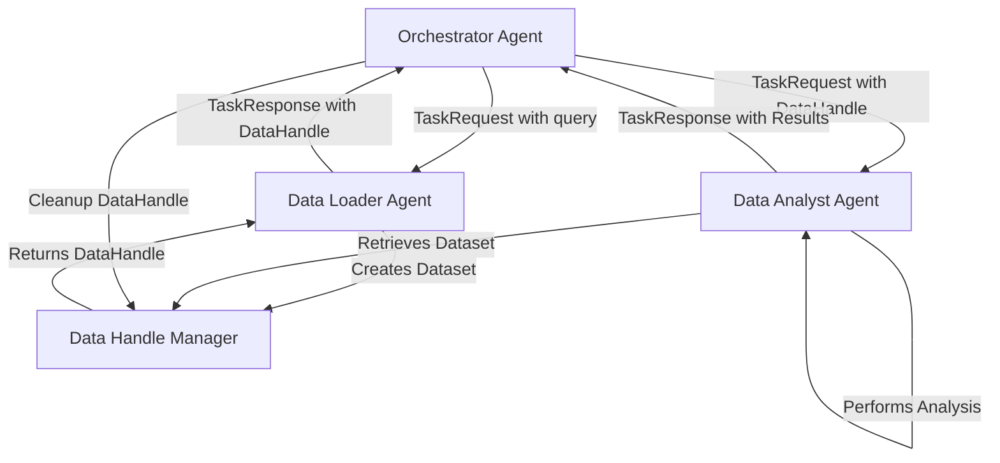

# Data Handle Workflow: Best Practices for Multi-Agent Data Transfer

## Overview

The Data Handle workflow is the **official best practice** for transferring large datasets between agents in the multi-agent system. Instead of passing raw data through task requests (which would be inefficient and could exceed message size limits), agents use lightweight references called "Data Handles" to share datasets efficiently.

## Architecture



## Core Components

### 1. DataHandle Model

```python
class DataHandle(BaseModel):
    handle_id: str              # Unique identifier
    data_type: str              # Type of data (dataframe, json, etc.)
    metadata: Dict[str, Any]    # Metadata about the data
    created_at: str             # Creation timestamp
    expires_at: Optional[str]   # Expiration timestamp
```

### 2. DataHandleManager

The `DataHandleManager` is a centralized service that:
- Creates handles for large datasets
- Stores datasets temporarily in memory/disk
- Provides retrieval by handle ID
- Manages handle lifecycle and cleanup
- Handles expiration and garbage collection

### 3. TaskRequest/TaskResponse Integration

```python
class TaskRequest(BaseModel):
    task_id: str
    correlation_id: str
    task_type: str
    parameters: Dict[str, Any]
    data_handles: List[DataHandle]  # ← Data handles instead of raw data
    priority: int

class TaskResponse(BaseModel):
    task_id: str
    correlation_id: str
    status: str
    results: Optional[Dict[str, Any]]
    error_message: Optional[str]
    data_handles: List[DataHandle]  # ← Return new/modified handles
    execution_time_ms: Optional[int]
```

## Implementation Guide

### Step 1: Data Producer (Data Loader Agent)

When a data loader agent successfully loads a dataset:

```python
async def load_data(self, file_path: str) -> TaskResponse:
    try:
        # Load the actual data
        df = pd.read_csv(file_path)
        
        # Create a data handle
        data_manager = get_data_handle_manager()
        handle = data_manager.create_handle(
            data=df,
            metadata={
                "source_file": file_path,
                "file_type": "CSV",
                "columns": list(df.columns),
                "shape": df.shape,
                "description": "Customer sales data"
            }
        )
        
        return TaskResponse(
            task_id=request.task_id,
            correlation_id=request.correlation_id,
            status="completed",
            results={
                "content": f"✅ Successfully loaded {len(df)} rows, {len(df.columns)} columns",
                "summary": "Dataset loaded and ready for analysis"
            },
            data_handles=[handle],  # Include the handle
            error_message=None,
            execution_time_ms=processing_time
        )
    except Exception as e:
        return TaskResponse(
            task_id=request.task_id,
            correlation_id=request.correlation_id,
            status="failed",
            results=None,
            error_message=str(e),
            data_handles=[],
            execution_time_ms=None
        )
```

### Step 2: Orchestrator Coordination

The orchestrator manages the complete workflow:

```python
async def coordinate_load_and_analyze(self, query: str, correlation_id: str) -> str:
    try:
        logger.info(f"[{correlation_id}] Starting load-and-analyze workflow with data handles")
        
        # Step 1: Load data via data-loader-agent
        load_task = TaskRequest(
            task_id=str(uuid.uuid4()),
            correlation_id=correlation_id,
            task_type="data_loading",
            parameters={"query": query, "description": "Load dataset for analysis"},
            data_handles=[],  # No input handles
            priority=7
        )
        
        load_response = await self._send_task_with_retry("data_loader_agent", load_task)
        
        if load_response.status != "completed":
            return f"Error: Data loading failed - {load_response.error_message}"
        
        # Step 2: Extract data handles from loader response
        if not load_response.data_handles:
            logger.warning(f"[{correlation_id}] No data handles returned from data loader")
            return "Error: No data handles received from data loader"
        
        data_handle = load_response.data_handles[0]
        logger.info(f"[{correlation_id}] Received data handle: {data_handle.handle_id}")
        
        # Step 3: Analyze data via data-analyst-agent
        analysis_task = TaskRequest(
            task_id=str(uuid.uuid4()),
            correlation_id=correlation_id,
            task_type="data_analysis",
            parameters={"analysis_type": "comprehensive", "description": "Analyze loaded dataset"},
            data_handles=load_response.data_handles,  # Pass handles to analyst
            priority=7
        )
        
        analysis_response = await self._send_task_with_retry("data_analyst_agent", analysis_task)
        
        if analysis_response.status != "completed":
            return f"Error: Data analysis failed - {analysis_response.error_message}"
        
        # Step 4: Cleanup data handles
        for handle in load_response.data_handles:
            try:
                self.data_manager.delete_handle(handle.handle_id)
                logger.debug(f"[{correlation_id}] Cleaned up data handle: {handle.handle_id}")
            except Exception as e:
                logger.warning(f"[{correlation_id}] Failed to cleanup handle {handle.handle_id}: {e}")
        
        return f"Analysis complete: {analysis_response.results.get('content', 'Analysis successful')}"
        
    except Exception as e:
        logger.error(f"[{correlation_id}] Error in load-and-analyze workflow: {e}")
        return f"Error: Orchestration failed - {str(e)}"
```

### Step 3: Data Consumer (Data Analyst Agent)

The data analyst retrieves and processes the data:

```python
async def analyze_data(self, request: TaskRequest) -> TaskResponse:
    try:
        # Extract data handles from request
        if not request.data_handles:
            return TaskResponse(
                task_id=request.task_id,
                correlation_id=request.correlation_id,
                status="failed",
                error_message="No data handles provided for analysis",
                data_handles=[],
                results=None
            )
        
        # Retrieve the actual data
        data_manager = get_data_handle_manager()
        handle = request.data_handles[0]
        df = data_manager.get_data(handle.handle_id)
        
        if df is None:
            return TaskResponse(
                task_id=request.task_id,
                correlation_id=request.correlation_id,
                status="failed",
                error_message=f"Data handle {handle.handle_id} not found or expired",
                data_handles=[],
                results=None
            )
        
        # Perform analysis
        analysis_result = perform_trend_analysis(df)
        
        return TaskResponse(
            task_id=request.task_id,
            correlation_id=request.correlation_id,
            status="completed",
            results={
                "content": analysis_result.summary,
                "structured_results": analysis_result.results,
                "analysis_type": analysis_result.analysis_type
            },
            data_handles=[],  # No new handles created
            error_message=None,
            execution_time_ms=processing_time
        )
        
    except Exception as e:
        return TaskResponse(
            task_id=request.task_id,
            correlation_id=request.correlation_id,
            status="failed",
            error_message=str(e),
            data_handles=[],
            results=None
        )
```

## Best Practices

### 1. Handle Lifecycle Management

- **Create handles immediately** after successful data loading
- **Include rich metadata** to help downstream agents understand the data
- **Always cleanup handles** after workflow completion
- **Set appropriate expiration times** based on workflow requirements

### 2. Error Handling

- **Check for handle existence** before attempting to retrieve data
- **Provide clear error messages** when handles are missing or expired
- **Clean up handles** even when workflows fail partway through
- **Log handle operations** with correlation IDs for debugging

### 3. Metadata Best Practices

Include these key metadata fields:

```python
metadata = {
    "source_file": "path/to/original/file.csv",
    "file_type": "CSV",
    "columns": ["col1", "col2", "col3"],
    "shape": [1000, 3],
    "description": "Customer transaction data for Q4 2024",
    "created_by": "data_loader_agent",
    "data_quality": {
        "missing_values": {"col1": 0, "col2": 5, "col3": 0},
        "duplicates": 0,
        "data_types": {"col1": "int64", "col2": "float64", "col3": "object"}
    }
}
```

### 4. Performance Considerations

- **Limit handle lifespan** to avoid memory bloat
- **Use appropriate data formats** (pandas DataFrame for structured data)
- **Monitor handle storage usage** and implement cleanup policies
- **Consider data compression** for large datasets

### 5. Security

- **Validate handle IDs** before data retrieval
- **Implement access controls** if needed
- **Log all handle operations** for audit trails
- **Sanitize metadata** to prevent injection attacks

## Example: Complete Workflow

Here's a complete example showing the data handle workflow in action:

```python
# 1. User requests: "Load sales_data.csv and analyze trends"

# 2. Orchestrator creates load task
load_task = TaskRequest(
    task_id="load-001",
    correlation_id="corr-abc123",
    task_type="data_loading",
    parameters={"file_path": "sales_data.csv"},
    data_handles=[],
    priority=7
)

# 3. Data Loader processes and creates handle
handle = data_manager.create_handle(
    data=sales_df,  # 10,000 rows × 15 columns
    metadata={
        "source_file": "sales_data.csv",
        "shape": [10000, 15],
        "file_type": "CSV",
        "description": "Sales transaction data"
    }
)

# 4. Data Loader returns response with handle
load_response = TaskResponse(
    task_id="load-001",
    correlation_id="corr-abc123",
    status="completed",
    results={"content": "✅ Loaded 10,000 rows, 15 columns"},
    data_handles=[handle],  # Light-weight reference, not the actual data
    error_message=None
)

# 5. Orchestrator creates analysis task with handle
analysis_task = TaskRequest(
    task_id="analysis-001",
    correlation_id="corr-abc123",
    task_type="data_analysis",
    parameters={"analysis_type": "trend_detection"},
    data_handles=[handle],  # Pass the handle, not the data
    priority=7
)

# 6. Data Analyst retrieves data and analyzes
sales_df = data_manager.get_data(handle.handle_id)
trends = analyze_trends(sales_df)

# 7. Data Analyst returns analysis results
analysis_response = TaskResponse(
    task_id="analysis-001",
    correlation_id="corr-abc123",
    status="completed",
    results={
        "content": "📈 Sales show 15% upward trend",
        "structured_results": trends.results
    },
    data_handles=[],
    error_message=None
)

# 8. Orchestrator cleans up handle
data_manager.delete_handle(handle.handle_id)
```

## Troubleshooting

### Common Issues

1. **Handle Not Found**
   - Check if handle has expired
   - Verify handle ID is correct
   - Ensure data manager is properly initialized

2. **Memory Usage High**
   - Implement regular cleanup of expired handles
   - Set appropriate expiration times
   - Monitor handle creation rate

3. **Performance Slow**
   - Consider data compression
   - Use appropriate data structures
   - Implement handle pooling if needed

### Debugging Tips

- Use correlation IDs to trace data flow
- Log all handle creation/deletion operations
- Monitor handle manager metrics
- Check handle metadata for data quality issues

## Migration Guide

### From Direct Data Passing

**Before (inefficient):**
```python
# DON'T DO THIS - passes raw data in task request
task = TaskRequest(
    task_id="analysis-001",
    parameters={"data": df.to_json(), "analysis_type": "trends"}  # ❌ Large payload
)
```

**After (efficient):**
```python
# DO THIS - use data handles
handle = data_manager.create_handle(data=df, metadata={"source": "api"})
task = TaskRequest(
    task_id="analysis-001",
    parameters={"analysis_type": "trends"},
    data_handles=[handle]  # ✅ Light-weight reference
)
```

This Data Handle workflow is now the **standard approach** for all inter-agent data transfer operations in the multi-agent system. It ensures scalability, efficiency, and proper resource management while maintaining clean separation of concerns between agents. 