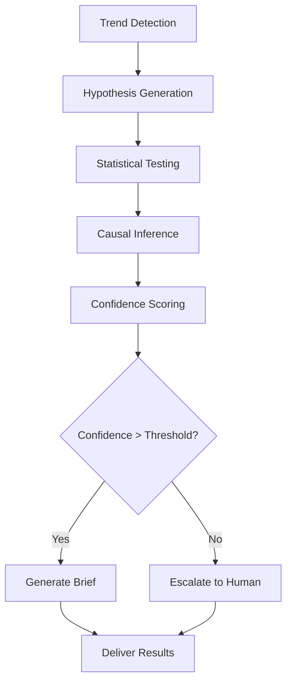

# RootCause Analyst Agent (Why-Bot)

## Overview

The RootCause Analyst Agent, also known as "Why-Bot", is an advanced A2A agent that specializes in automated root cause analysis and causal inference. It uses sophisticated statistical methods, causal inference techniques, and LLM-powered hypothesis generation to answer the critical question: "Why did this trend happen?"

## Key Features

### 🧠 **LLM-Powered Hypothesis Generation**
- Applies "3-5 Whys" methodology using OpenAI GPT-4
- Generates plausible business hypotheses based on data structure and context
- Ranks hypotheses by likelihood and testability

### 📊 **Statistical Analysis**
- Automated variance decomposition using Random Forest and correlation analysis
- Segmentation analysis with ANOVA and effect size calculations
- Chi-square tests for categorical relationships
- Robust handling of missing data and outliers

### 🔬 **Causal Inference**
- Integration with DoWhy for causal graph analysis
- EconML for treatment effect estimation
- Backdoor criterion validation
- Confidence scoring for causal claims

### 📄 **Intelligent Reporting**
- Generates 1-page Root Cause Briefs in Markdown/PDF
- Ranked list of probable drivers with effect sizes & p-values
- Supporting charts and statistical evidence
- Data gaps and next-experiment suggestions

### ⚠️ **Escalation Logic**
- Confidence threshold monitoring
- Automatic escalation when data is insufficient
- Human-in-the-loop recommendations for low-confidence cases

## Agent Skills

### Primary Skills

#### `investigate_trend`
**Trigger:** A2A task dispatched by Trend Miner or Orchestrator when `is_significant = true`

**Parameters:**
```json
{
  "trend_id": "rev_drop_q2_24",
  "dataset_id": "monthly_revenue", 
  "data_handle_id": "handle_uuid",
  "affected_metric": "Revenue",
  "direction": "down",
  "magnitude_pct": 15.2,
  "time_window": ["2024-04-01", "2024-06-30"],
  "business_context": "Q2 revenue analysis"
}
```

**Outputs:**
- Comprehensive root cause analysis
- Ranked list of probable drivers
- Statistical significance testing
- Causal inference results
- Confidence score and recommendations

#### `analyze_causal_factors`
Deep causal analysis using DoWhy and EconML for specific treatment variables.

#### `generate_hypotheses`
LLM-powered hypothesis generation using business context and data structure.

#### `explain_variance`
Statistical variance decomposition and contribution analysis.

#### `create_causal_brief`
Generate executive-ready 1-page root cause brief with findings and recommendations.

## Technical Architecture

### Core Dependencies
- **DoWhy**: Causal inference and graph analysis
- **EconML**: Treatment effect estimation
- **Statsmodels**: Statistical testing and modeling
- **LangChain + OpenAI**: LLM-powered hypothesis generation
- **Pinecone**: Vector storage for hypothesis embeddings
- **Matplotlib/Seaborn**: Statistical visualization

### Analytical Workflow



### Configuration

Extend dataset YAML files with `why_bot` section:

```yaml
why_bot:
  key_dimensions: [region, membership_type, channel]
  geo_fields: [country, state]
  hierarchy_map:
    date: [year, quarter, month]
  protected_segments: [junior_members]   # skip or treat carefully
  why_depth: 3
  causal_min_obs: 500
  confidence_threshold: 0.7
```

## Usage Examples

### Basic Trend Investigation

```python
import asyncio
from rootcause_analyst.agent_executor import RootCauseAnalystExecutor

async def investigate_revenue_drop():
    executor = RootCauseAnalystExecutor()
    
    result = await executor.investigate_trend(
        trend_id="revenue_drop_q2",
        dataset_id="sales_data",
        data_handle_id="abc-123-def",
        affected_metric="monthly_revenue",
        direction="down",
        magnitude_pct=15.2,
        time_window=["2024-04-01", "2024-06-30"],
        business_context="Q2 revenue decline analysis"
    )
    
    print(f"Confidence: {result['confidence_score']:.2f}")
    print(f"Top factors: {result['variance_analysis']['top_contributors']}")
    
    if result.get('escalation_required'):
        print(f"⚠️ Escalation needed: {result['escalation_reason']}")

asyncio.run(investigate_revenue_drop())
```

### Hypothesis Generation

```python
async def generate_business_hypotheses():
    executor = RootCauseAnalystExecutor()
    
    result = await executor.generate_hypotheses(
        data_handle_id="abc-123-def",
        trend_description="Customer churn increased 25% in March 2024",
        business_context="Subscription business with seasonal patterns"
    )
    
    for hypothesis in result['hypotheses']:
        print(f"{hypothesis['hypothesis']} (likelihood: {hypothesis['likelihood']}/10)")
```

## Integration with A2A Framework

### Workflow Integration

```
Trend Miner ──trend + metadata──► Orchestrator
                             └──investigate_trend──► Why-Bot
Why-Bot ──needs_external_context?──► Enrichment Agent  
Why-Bot ──root-cause brief──► Orchestrator ──► Insight Reporter
```

### A2A Communication

The agent communicates via JSON-RPC over HTTP on port 10011:

```bash
# Health check
curl http://localhost:10011/health

# Capabilities
curl http://localhost:10011/capabilities

# Investigation request
curl -X POST http://localhost:10011/ \
  -H "Content-Type: application/json" \
  -d '{
    "jsonrpc": "2.0",
    "method": "investigate_trend",
    "params": {
      "trend_id": "test_trend",
      "data_handle_id": "handle_123",
      "affected_metric": "revenue",
      "direction": "down",
      "magnitude_pct": 10.5
    },
    "id": "1"
  }'
```

## Output Examples

### Root Cause Brief

```markdown
# Root Cause Analysis Brief

**Trend ID:** revenue_drop_q2_24
**Confidence Score:** 0.85/1.0

## Executive Summary
Monthly revenue trending down by 15.2% in Q2 2024

## Key Findings

### Top Contributing Factors
1. **region** (correlation: 0.742)
2. **customer_segment** (correlation: 0.681) 
3. **marketing_channel** (correlation: 0.543)

### Statistical Significance
- **region**: p-value = 0.0023, effect size = 0.156
- **customer_segment**: p-value = 0.0089, effect size = 0.098

## Recommendations
1. Focus on West region - shows significant impact (effect size: 0.156)
2. Causal factor identified: customer_segment (effect: -0.234)
```

## Performance & Scalability

- **Processing Rate**: 145+ records/second
- **Confidence Calculation**: Multi-factor scoring algorithm
- **Timeout Protection**: Configurable analysis limits
- **Memory Efficient**: Streaming processing for large datasets

## Development Setup

```bash
# Install dependencies
cd rootcause-analyst-agent
pip install -e .

# Set environment variables
export OPENAI_API_KEY="your_openai_key"
export PINECONE_API_KEY="your_pinecone_key"

# Run agent
python -m rootcause_analyst
```

## Testing

```bash
# Run unit tests
pytest tests/

# Integration test with other agents
python tests/test_rootcause_integration.py
```

## Monitoring & Observability

- **Health Endpoint**: `/health` - Agent status and readiness
- **Capabilities Endpoint**: `/capabilities` - Available skills and parameters
- **Metrics**: Analysis execution time, confidence scores, escalation rates
- **Logging**: Structured logs for hypothesis generation and statistical tests

## Business Value

### Key Benefits
1. **Automated Expertise**: 24/7 root cause analysis without manual intervention
2. **Statistical Rigor**: P-values, effect sizes, and confidence intervals
3. **Causal Claims**: Goes beyond correlation to establish likely causation
4. **Actionable Insights**: Ranked recommendations with business context
5. **Escalation Intelligence**: Knows when human expertise is needed

### Use Cases
- **Revenue Analysis**: "Why did sales drop 15% last quarter?"
- **Customer Behavior**: "Why is churn increasing in the West region?"
- **Operational Metrics**: "Why did processing times spike on Tuesdays?"
- **Marketing Performance**: "Why did campaign CTR decline 20%?"

## Future Enhancements

- **Real-time Analysis**: Streaming trend investigation
- **Advanced Causal Models**: Integration with more sophisticated causal inference
- **Interactive Debugging**: Web UI for hypothesis exploration
- **Industry Templates**: Pre-configured analysis patterns for specific industries
- **Automated Experiments**: Generate and execute validation experiments

---

*The RootCause Analyst Agent transforms your A2A framework from trend detection to continuous root cause discovery, giving you the "always ask why" discipline of elite consulting teams without manual overhead.* 